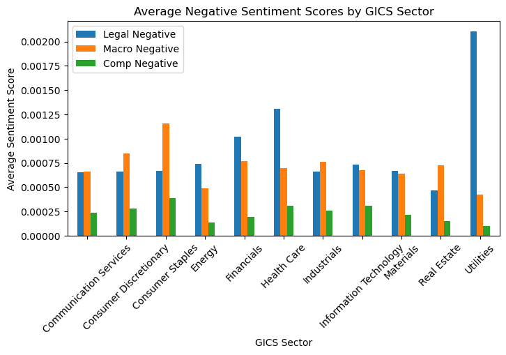
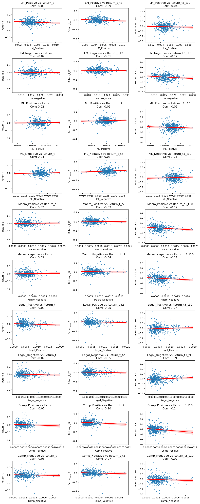

# *Midterm Report - Owen English - LeDataSciFi*

### Summary Section

**Question:**

In this project I investigated how the sentiment in 10K filings impacts stock returns around the filing date. Specifically, examing whether positive or negative sentiment impacts short-term stock price performance. 

**Methodology:**
- Collected 10-K filings from S&P 500 firms for the year 2022.
- Extracted filing dates using SEC’s Edgar database and matched them to stock return data.
- Measured sentiment using two different dictionaries:
- Loughran-McDonald (LM) – Finance-specific sentiment dictionary.
- Machine Learning (ML) – A more recent data-driven sentiment dictionary.
- Created contextual sentiment variables to analyze how specific topics (e.g., macroeconomic factors, legal issues, competition) influence sentiment and returns.
- Calculated buy-and-hold stock returns around the filing date in three windows
- 1. Day of filing (t)
- 2. Filing day to two days after (t to t+2, business days only)
- 3. Three to ten days after filing (t+3 to t+10, business days only)

**Findings:**

The correlation analysis and regression results suggest that sentiment in 10-K filings has little predictive power for short-term stock returns. The regression model explains only 2.5% of return variation (R² = 0.025), and none of the sentiment variables are statistically significant predictors. Interestingly, positive sentiment measures tend to have negative coefficients, suggesting a weak inverse relationship with returns, while negative sentiment shows mixed effects. Overall, the lack of strong statistical significance suggests that sentiment alone does not meaningfully explain stock price movements.

### Data Section

**Sample:**

The sample consists of 498 firms from the S&P 500 index that had 10K filings for the year of 2022. These firms span multiple industries including communication services, consumer discretionary, consumer staples, energy, financials, healthcare, industrials, information technology, materials, real estate, and utilities. 

**Construction of Return Variables:**

Stock return data was obtained from a dataset labeled as CRSP returns. Three different return measures were calculated relative to each firm’s 10-K filing date:

- Filing Day Return: The stock return on the exact day of the 10-K filing.
- Short-Term Cumulative Return: The cumulative return from the filing day to two trading days after reflecting the immediate market reaction.
- Medium-Term Cumulative Return: The cumulative return from three to ten trading days post-filing, capturing any delayed reaction to sentiment.

The cumulative returns for the short-term and medium-term windows were calculated using the following formula:

R*c* =  ∏(1+r*i*) - 1

r*i* Represents the daily stock returns over the relevant window.

And to align returns with the 10-K filing dates:

- Filing dates for each firm were obtained from the SEC’s EDGAR database by scraping the company search results page. The script checked for the first available 10-K filed in 2022 and stored the corresponding date.
- Each firm's Central Index Key (CIK) was mapped to its stock ticker to ensure consistency between the 10-K filings dataset and the stock return dataset.
- Trading days were numbered sequentially for each stock to establish a timeline.
- The event time (t=0) was defined as the trading day on which the firm filed its 10-K.
- The return windows were extracted based on this event time.


**Construction of Sentiment Variables:**

The sentiment variables were built in several steps, starting with the extraction and cleaning of 10-K filings. For each S&P 500 firm, the most recent 10-K was located inside a ZIP archive using its CIK number. These HTML files were parsed with BeautifulSoup, hidden sections were removed, and the text was cleaned by lowercasing, removing punctuation, and removing whitespace. The final cleaned text was stored in my sp500_df.

Two sets of sentiment dictionaries were used:

1. LM (Loughran-McDonald): 347 positive words, 2,345 negative words
2. ML (machine learning-derived): 75 positive words, 94 negative words

Following this each word list was searched in the 10-Ks, and the number of matches counted and then divided by document word count. This produced four standard sentiment scores: LM_Positive, LM_Negative, ML_Positive, and ML_Negative.

To capture more specific tone, I created three contextual sentiment variables:

1. Macroeconomic factors: Words like “inflation,” “recession,” and “interest rate”
2. Legal/Regulatory: Terms such as “litigation,” “penalty,” and “compliance”
3. Competition: Phrases like “market share,” “disruption,” and “pricing pressure”

For each topic, the number of positive and negative ML sentiment words appearing within 20 words of a topic-related keyword was counted using a custom NEAR_regex function. I set max_words_between = 20, partial = False, and greedy = True to ensure precision in matching close word proximity without overextending matches or capturing partial text. Then the contextual sentiment variables (Macro_Positive, Macro_Negative, Legal_Positive, Legal_Negative, Comp_Positive, Comp_Negative) were calculated the same way as the LM and ML sentiment variables.

Justification for Topics:

1. Macroeconomic factors: I wanted to see if firm sentiment is less predictive when tied to external market risk factors like GDP or inflation, which may already be priced in broadly.
2. Legal/Regulatory: My hypothesis was that these risks might also be anticipated and priced in, making sentiment in this area less impactful.
3. Competition: I expected sentiment about competitive dynamics to be the most reactive, as investors may interpret changes in market position more directly as firm-specific risk or opportunity.

**Summary Statistics:**


```python
import pandas as pd

# Load the cleaned dataset
file_path = "output/analysis_sample.csv"  # Adjust path if needed
sp500_df = pd.read_csv(file_path)

summary_stats = sp500_df.describe()
print(summary_stats)
```

                    CIK  LM_Positive  LM_Negative  ML_Positive  ML_Negative  \
    count  4.980000e+02   498.000000   498.000000   498.000000   498.000000   
    mean   7.851046e+05     0.004959     0.015738     0.024093     0.025695   
    std    5.501943e+05     0.001317     0.003694     0.003557     0.003424   
    min    1.800000e+03     0.001195     0.006629     0.008019     0.009088   
    25%    9.727650e+04     0.004079     0.013103     0.021944     0.023815   
    50%    8.825095e+05     0.004860     0.015577     0.024261     0.025695   
    75%    1.136007e+06     0.005630     0.017666     0.026201     0.027644   
    max    1.868275e+06     0.010941     0.030123     0.038135     0.037797   
    
           Macro_Positive  Macro_Negative  Legal_Positive  Legal_Negative  \
    count      498.000000      498.000000      498.000000      498.000000   
    mean         0.000711        0.000729        0.000538        0.000881   
    std          0.000336        0.000328        0.000317        0.000508   
    min          0.000107        0.000125        0.000046        0.000167   
    25%          0.000477        0.000499        0.000327        0.000546   
    50%          0.000662        0.000685        0.000437        0.000726   
    75%          0.000876        0.000893        0.000649        0.001028   
    max          0.002413        0.002330        0.002008        0.003218   
    
           Comp_Positive  Comp_Negative    Return_t  Return_t_t2  Return_t3_t10  
    count     498.000000     498.000000  489.000000   489.000000     489.000000  
    mean        0.000226       0.000250    0.000742     0.003360      -0.008298  
    std         0.000137       0.000135    0.034294     0.052256       0.064521  
    min         0.000011       0.000030   -0.242779    -0.447499      -0.288483  
    25%         0.000130       0.000154   -0.016493    -0.025470      -0.048074  
    50%         0.000205       0.000225   -0.001638     0.000101      -0.009594  
    75%         0.000294       0.000324    0.015826     0.028495       0.029010  
    max         0.001188       0.000946    0.162141     0.229167       0.332299  


The summary statistics show that sentiment variables have low mean values, indicating that positive and negative words make up a small fraction of 10-K filings. Stock return measures exhibit typical market behavior, with filing-day returns centered around zero and greater dispersion in short- and medium-term cumulative returns. 

**Contextual Sentiment Variables "Smell Test"**


```python
import matplotlib.pyplot as plt

gics_sentiment = sp500_df.groupby("GICS Sector")[['Legal_Negative', 'Macro_Negative', 'Comp_Negative']].mean()
gics_sentiment.plot(kind='bar', figsize=(8,4))
plt.title("Average Negative Sentiment Scores by GICS Sector")
plt.ylabel("Average Sentiment Score")
plt.xlabel("GICS Sector")
plt.xticks(rotation=45)
plt.legend(["Legal Negative", "Macro Negative", "Comp Negative"])
plt.show()

```


    

    


The contextual sentiment measures pass basic smell tests. The summary statistics confirm sufficient variation across sentiment variables, ensuring they are not constant. The bar chart further validates the expected trends as industries with higher legal and regulatory exposure, such as utilities and financials, exhibit higher negative legal sentiment scores. This aligns with intuition, as these sectors face greater regulatory scrutiny. Overall, the dataset passes the basic "smell test".

**Potential Caveats Regarding the Data/Analysis:**

One potential limitation is that sentiment models may misinterpret financial language. Certain terms like "risk" or "liability," which are common in SEC filings, may not always carry a negative connotation, leading to possible misclassification. Additionally, the near_regex function assumes that words appearing near topic-related keywords are contextually relevant, but some instances may be coincidental. Lastly, because the dataset focuses exclusively on S&P 500 firms, the results may not be applicable to smaller companies or international markets, where reporting practices and risk factors could differ.

### Results Section

**Correlation Table**


```python
sentiment_measures = ["LM_Positive", "LM_Negative", "ML_Positive", "ML_Negative",
                      "Macro_Positive", "Macro_Negative", "Legal_Positive", "Legal_Negative",
                      "Comp_Positive", "Comp_Negative"]

return_measures = ["Return_t", "Return_t_t2", "Return_t3_t10"]

correlation_table = sp500_df[sentiment_measures + return_measures].corr().loc[sentiment_measures, return_measures]

print(correlation_table)

```

                    Return_t  Return_t_t2  Return_t3_t10
    LM_Positive    -0.092800    -0.087824      -0.039515
    LM_Negative    -0.020574    -0.014589      -0.121249
    ML_Positive     0.018640     0.050345      -0.048237
    ML_Negative     0.038358     0.084202       0.042361
    Macro_Positive  0.018146    -0.028001      -0.118565
    Macro_Negative  0.027136    -0.036867      -0.110462
    Legal_Positive -0.085862    -0.047790       0.065692
    Legal_Negative -0.070973    -0.049452       0.090292
    Comp_Positive  -0.069022    -0.100063      -0.136478
    Comp_Negative  -0.045422    -0.071754      -0.068417


```python
import numpy as np
import seaborn as sns 
sentiment_measures = ["LM_Positive", "LM_Negative", "ML_Positive", "ML_Negative",
                      "Macro_Positive", "Macro_Negative", "Legal_Positive", "Legal_Negative",
                      "Comp_Positive", "Comp_Negative"]

return_measures = ["Return_t", "Return_t_t2", "Return_t3_t10"]


fig, axes = plt.subplots(10, 3, figsize=(12, 30))  # 10 sentiment measures x 3 return measures

for i, sentiment in enumerate(sentiment_measures):
    for j, ret in enumerate(return_measures):
        ax = axes[i, j]  # Select subplot position
        
        sns.regplot(x=sp500_df[sentiment], y=sp500_df[ret], ax=ax, scatter_kws={'s':5}, line_kws={'color':'red'})
        
        corr = sp500_df[[sentiment, ret]].corr().iloc[0, 1]
        
        ax.set_title(f"{sentiment} vs {ret}\nCorr: {corr:.2f}")

plt.tight_layout()
plt.show()

```


    

    


**Discussion Topics**

**1:**

LM sentiment shows weak or slightly negative correlations with returns, suggesting that traditional sentiment measures may not capture strong price reactions. LM_Positive has a small negative correlation (-0.09) with Return_t, while LM_Negative is close to zero (-0.02), indicating minimal predictive power. In contrast, ML sentiment shows slightly positive correlations, with ML_Negative at 0.04 and ML_Positive near zero (0.02), implying that machine learning-based sentiment may capture different aspects of tone that influence stock prices. ML sentiment is also more stable across different return periods.

**2:**

My results align with Garcia, Hu, and Rohrer in showing that ML sentiment has a stronger relationship with returns than LM sentiment. Like their study, I found ML_Positive more predictive of returns, while LM sentiment had weaker effects.
However, there are key differences. Their study found a slight negative relationship for LM_Negative (-0.06) and ML_Negative (-0.05), while mine showed little to no correlation. These discrepancies could be the result of my smaller dataset or differences in sample periods. Their larger dataset (76,922 filings) likely accounts for broader market conditions and firm characteristics. This broader scope is likely why they had more statistically significant results than me.

**3:**

Overall, macro sentiment shows a slight positive correlation with same-day returns, suggesting that mentions of economic factors may not be viewed as purely negative by investors. Legal sentiment has little to no relationship with returns, reinforcing the idea that regulatory risks are often anticipated and already priced in. Competition sentiment also shows a weak correlation, indicating that concerns about market positioning do not drive immediate stock price reactions in a meaningful way. While none of these relationships are particularly strong, the slight positive correlation in macro sentiment may be worth further investigation to understand how investors interpret broader economic discussions in filings.

**4:**

The correlations for ML sentiment vary in both sign and magnitude across time periods. ML Positive starts slightly positive on filing day but turns negative over longer windows, suggesting initial optimism fades. ML Negative has a small positive correlation at first, contradicting expectations, but weakens over time. This could be due to the ML dictionary capturing cautious language rather than outright bad news, or investors reacting initially but adjusting as more information emerges. The small correlations suggest sentiment matters but isn’t the primary driver of returns, especially in longer time frames.  
